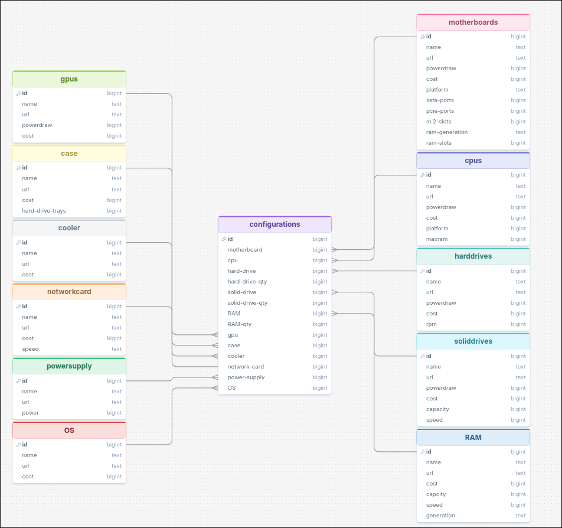
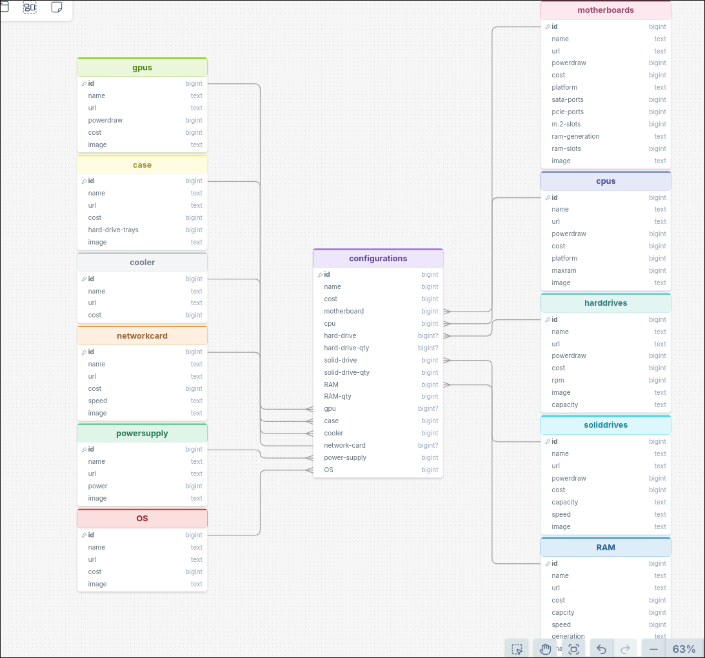
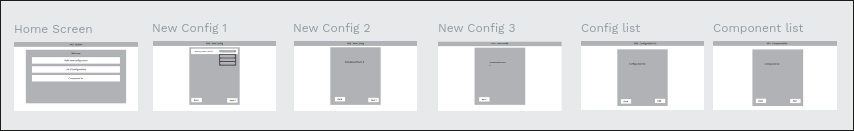
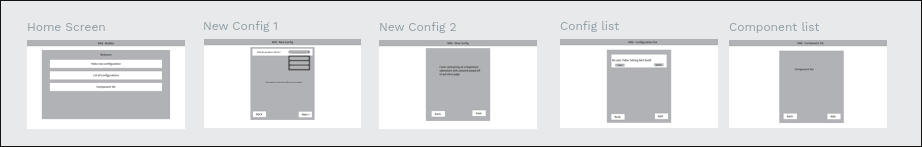
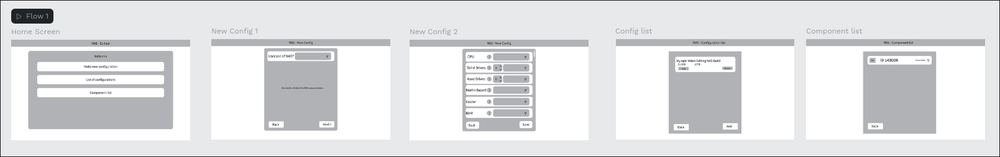

# Sprint 1 - Developing a DB and UI Prototype

## Sprint Goals

Develop a design for the database and a UI prototype that simulates the key functionality of the system. Test and refine the UI so that it can serve as the model for the next phase of development in Sprint 2.

### Specific Goals

**Edit these goals as needed**

- Design the database:
    - Tables
    - Fields / types
    - Primary keys
    - Default / nullable values
    - Relationships (foreign keys)
- Design the UI
    - Key pages
    - User interactions and 'flow'
    - Page layouts / features
    - Colour palette
    - Etc.

## Initial Database Design

Replace this text with notes regarding the DB design.

### Required Data Input

The user will need to select the parts for their build configuration.
 - Motherboard
 - CPU
 - Hard Drive
 - Solid State Drive
 - RAM
 - GPU
 - Case
 - Cooler
 - Network Card
 - PSU
 - OS

### Required Data Output

An overview of the user's build

### Required Data Processing

I need to be able to:
 - Make recomendations based off desired usable captity - based on raid configuration (will have raid 0, 1, 3 as options), which includes doing math
 - Ensure that all components are compatable via filtering, this needs to be done automaticly so that the user cant pick incompatable parts.

## Updated Database Design

After talking with my stakeholder we determined that we needed to make some of the fields nullable for things that would be optional. As well as images for each component.

My stakeholder also pointed out that names for the configurations would be good

## UI 'Flow'

The first stage of prototyping was to explore how the UI might 'flow' between states, based on the required functionality.

This Figma demo shows the initial design for the UI 'flow':

https://design.penpot.app/#/view?file-id=ddb7145f-a1be-80bb-8008-6c66e6a5af36&page-id=ddb7145f-a1be-80bb-8008-6c66e6a5af37&section=interactions&index=0&zoom=fit&share-id=3be9e5e1-190f-8090-8008-76dbf646c443

### Testing

After doing testing with my stakeholder we noticed a couple flaws notibly, I need a save button for configurations and also it would be much better to have all of the components on one form as making changes is easier, especially for editing.

### Changes / Improvements

I added a save button and also moved it down to one form for compents. I also added some additional explanatory text for the clairty of the flow.

- Need description of what it means once you've picked type of NAS with description of what the implications of that are.
- Base preset from recomadations, explanation of all compontent types and what they mean. Drop down selection for components. 
- All components on one form as going between pages is annoying (if you want to make) and there is not that many.
- Edit button on configs.

"Having everyting on one page rather than pushing back three times to change a quantity of something would be user friendly" - Gareth 9/8

"The ability to save and come back in 2 days time to make changes" -Gareth 9/8

https://design.penpot.app/#/view?file-id=81f57451-85cc-819d-8008-76d2b50d68ee&page-id=ddb7145f-a1be-80bb-8008-6c66e6a5af37&section=interactions&index=0&share-id=81f57451-85cc-819d-8008-76dd91f797d4

## Initial UI Prototype

The next stage of prototyping was to develop the layout for each screen of the UI.

This Figma demo shows the initial layout design for the UI:

https://design.penpot.app/#/view?file-id=81f57451-85cc-819d-8008-76eaa95d78e5&page-id=ddb7145f-a1be-80bb-8008-6c66e6a5af37&section=interactions&frame-id=e3c6c87b-c84b-8035-8008-6c670b350cbb&index=0&zoom=fit&share-id=81f57451-85cc-819d-8008-7960de20a8b7 

### Testing

Replace this text with notes about what you did to test the UI flow and the outcome of the testing.

### Changes / Improvements

Replace this text with notes any improvements you made as a result of the testing.

*FIGMA IMPROVED PROTOTYPE - PLACE THE FIGMA EMBED CODE HERE - MAKE SURE IT IS SET SO THAT EVERYONE CAN ACCESS IT*

## Refined UI Prototype

Having established the layout of the UI screens, the prototype was refined visually, in terms of colour, fonts, etc.

This Figma demo shows the UI with refinements applied:

*FIGMA REFINED PROTOTYPE - PLACE THE FIGMA EMBED CODE HERE - MAKE SURE IT IS SET SO THAT EVERYONE CAN ACCESS IT*

### Testing

Replace this text with notes about what you did to test the UI flow and the outcome of the testing.

### Changes / Improvements

Replace this text with notes any improvements you made as a result of the testing.

*FIGMA IMPROVED REFINED PROTOTYPE - PLACE THE FIGMA EMBED CODE HERE - MAKE SURE IT IS SET SO THAT EVERYONE CAN ACCESS IT*

## Sprint Review

Replace this text with a statement about how the sprint has moved the project forward - key success point, any things that didn't go so well, etc.

