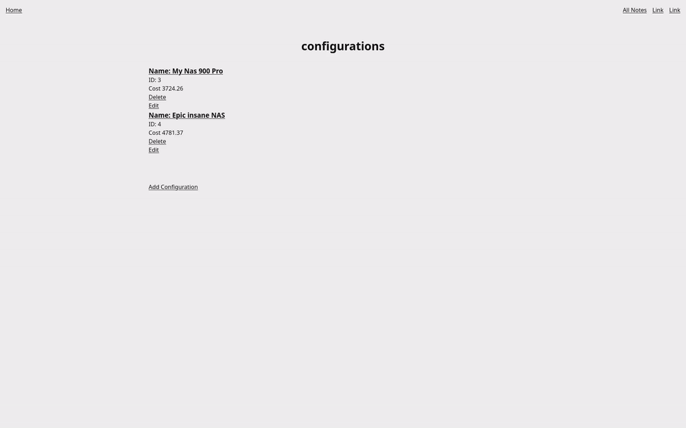
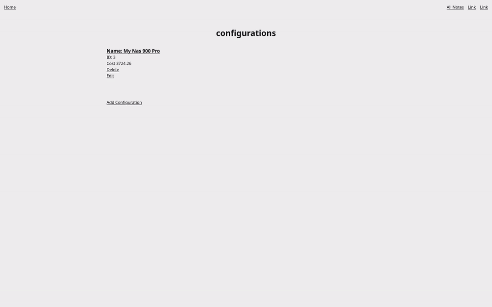

# Sprint 2 - Implement Database and Display of Test Data

## Sprint Goals

Implement the database, populated with test data. Create queries that retrieve test data, and display this on web pages as needed. Test and refine the queries and data display, so that it stands as the basis of the next sprint.

### Specific Goals

**Edit these goals as needed**

- Implement the database
- Add test data to the database
- Create the following web pages:
    - Page showing list of all components and their data
    - Page for creating Configurations
    - Page for adding Configurations
    - General home page
- Develop SQL database queries to:
    - Retrieve all Configurations and the parts inside of them
    - Retrieve specific Configuration
    - Show all components and all their parts
- Be able to add, delete and edit data from the database (configurations)

## Testing Deleting configuration

This tests shows me deleting a configuration

### Changes / Improvements

Added flash text to show that a configuration has been succsesfully deleted as stakeholder suggested

## Testing FEATURE NAME HERE

Replace this text with notes about what you are testing, how you tested it, and the outcome of the testing

**PLACE SCREENSHOTS AND/OR ANIMATED GIFS OF THE TESTING HERE**

### Changes / Improvements

Added flash text to show that a configuration has been succsesfully added as stakeholder suggested

**PLACE SCREENSHOTS AND/OR ANIMATED GIFS OF THE IMPROVED SYSTEM HERE**

## Testing FEATURE NAME HERE

Replace this text with notes about what you are testing, how you tested it, and the outcome of the testing

**PLACE SCREENSHOTS AND/OR ANIMATED GIFS OF THE TESTING HERE**

### Changes / Improvements

Replace this text with notes any improvements you made as a result of the testing.

**PLACE SCREENSHOTS AND/OR ANIMATED GIFS OF THE IMPROVED SYSTEM HERE**

## ETC...

High quality versions of the files can be found at
[here](/screenshots/high_quality_videos/)

## Sprint Review

Replace this text with a statement about how the sprint has moved the project forward - key success point, any things that didn't go so well, etc.

