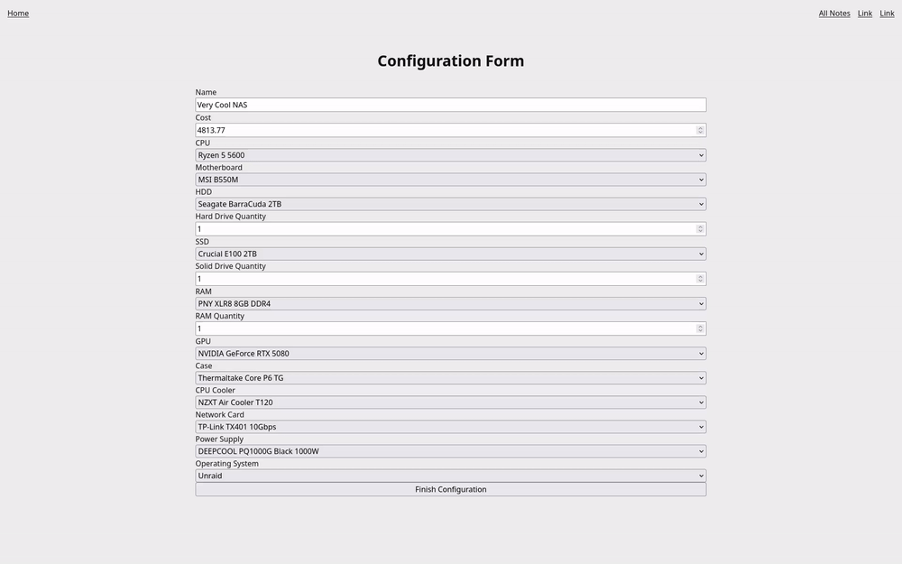
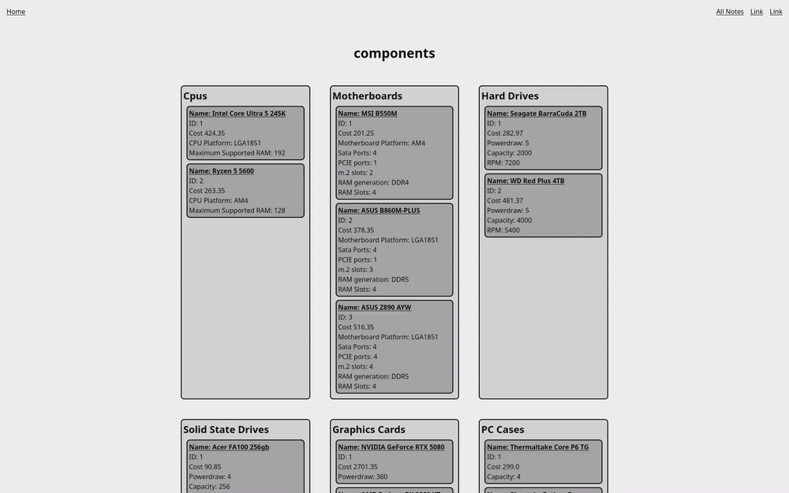
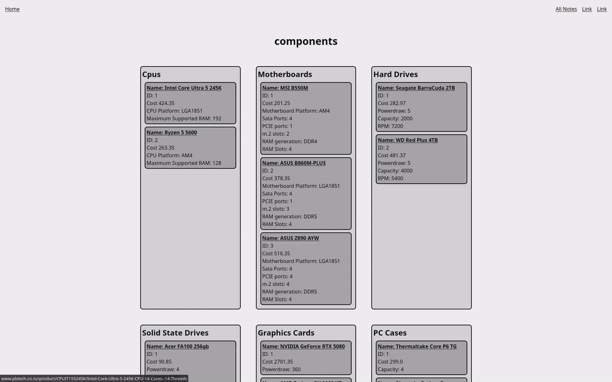
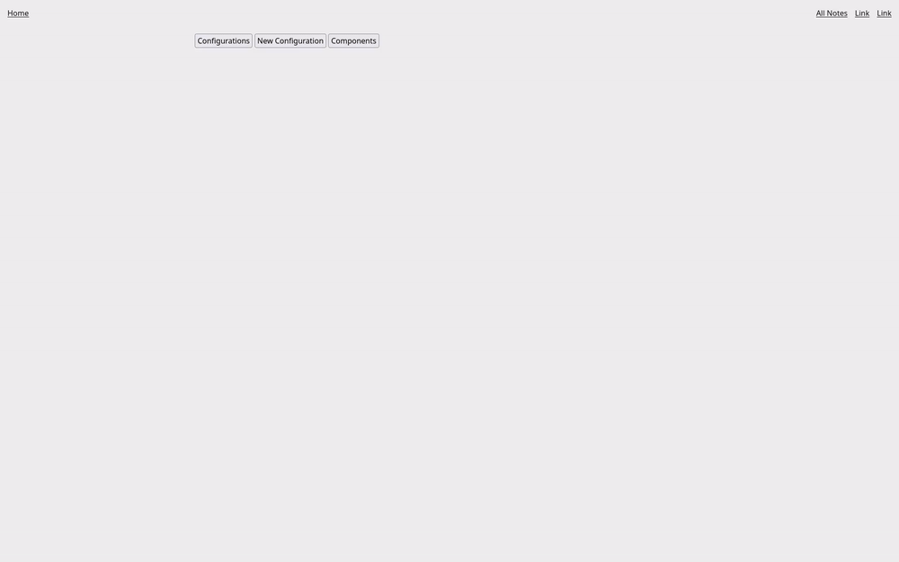
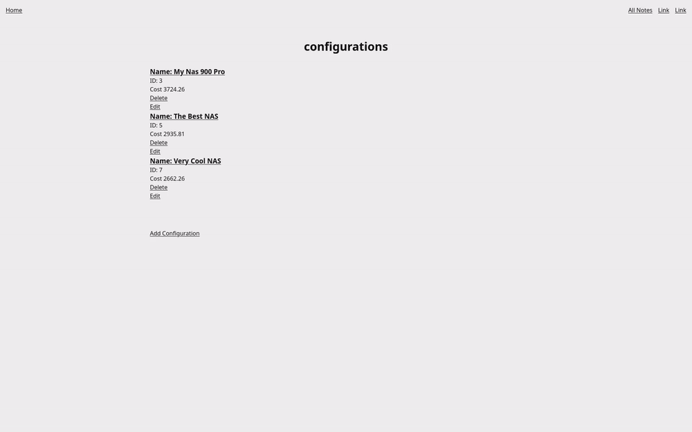
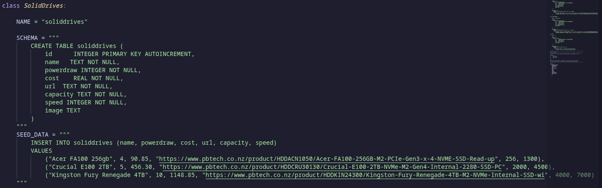
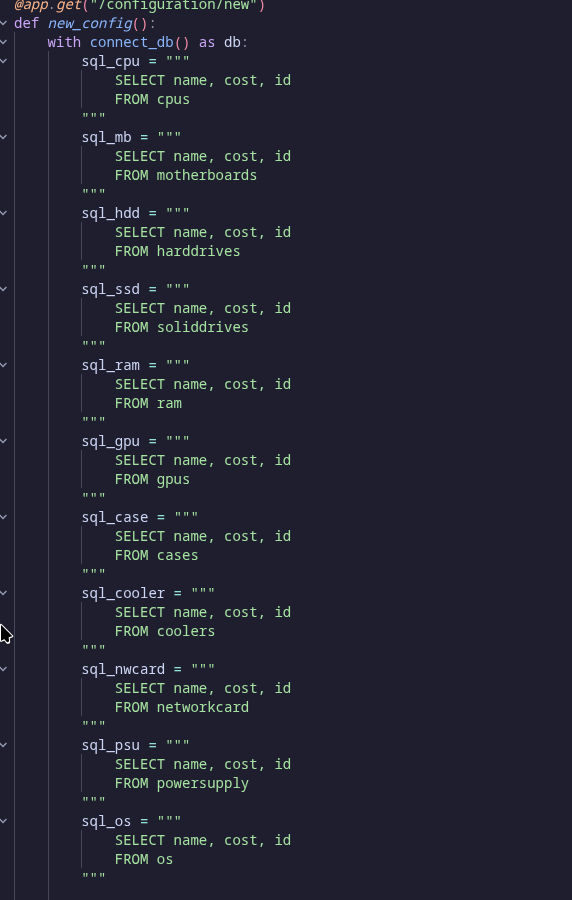

# Sprint 2 - Implement Database and Display of Test Data

## Sprint Goals

Implement the database, populated with test data. Create queries that retrieve test data, and display this on web pages as needed. Test and refine the queries and data display, so that it stands as the basis of the next sprint.

### Specific Goals

**Edit these goals as needed**

- Implement the database
- Add test data to the database
- Create the following web pages:
    - Page showing list of all components and their data
    - Page for creating Configurations
    - Page for adding Configurations
    - General home page
- Develop SQL database queries to:
    - Retrieve all Configurations and the parts inside of them
    - Retrieve specific Configuration
    - Show all components and all their parts
- Be able to add, delete and edit data from the database (configurations)

I descussed with my stakeholder to come to these as the requirements for this sprint

"For this sprint you should focus on getting the data loaded into the database, would be great if from the UI you could then show all the parts available and be able to create a shopping list for a possible NAS .  Doesn’t need to be pretty focus on quality of the data and the ability to see the data from the UI." - Gareth

## Testing Deleting configuration

This tests shows me deleting a configuration, this shows how one of my pages interacts with my database by removing data from the configuration table

### Changes / Improvements

Added flash text to show that a configuration has been succsesfully deleted as stakeholder suggested

## Testing Adding configuration

This tests shows me adding a configuration, this shows how one of my pages interacts with my database by adding data to the configuration table

### Changes / Improvements

Added flash text to show that a configuration has been succsesfully added as stakeholder suggested

## Testing Editing configuration

This tests shows me adding a configuration, this shows how one of my pages interacts with my database by updating data in the configuration table

### Changes / Improvements

Added flash text to show that a configuration has been succsesfully edited as stakeholder suggested

## Testing component page

This test shows me testing the component page of my site

### Changes / Improvements

My stakeholder suggested that when opening a link to a component it should take you to a new tab rather than replacing the current

## General home page testing

This test shows some general testing of my home page

## Testing configuration page

Doing general testing of configuration page in regards to viewing configurations

### Changes / Improvements

My stakeholder suggested that I need to add a back button on the configuration pages.

## Evidince for queries and seed data

### Seed Data For SSDs

### Query for adding new configurations

## Sprint Review

This sprint has moved the project foward as I now have a database implemented with basic functionality and seed data, I have done this while talking to my stakeholder throughout to ensure that they are happy with the product. I still need to add a decent amount of functionallity and QOL these things are not related to the database and will be part of my MVP and final sprints (sprint 3 and 4).

