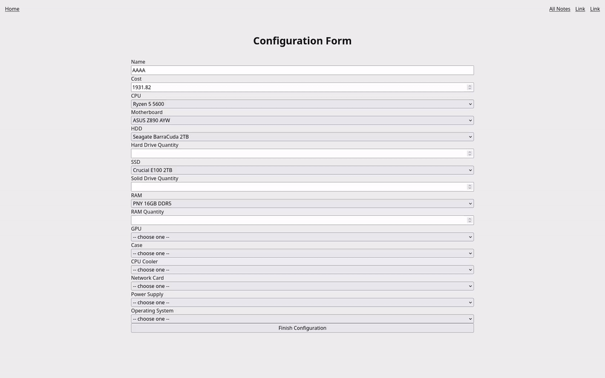
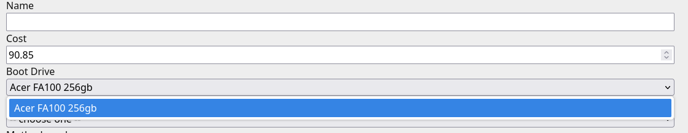
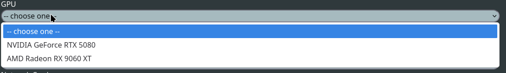
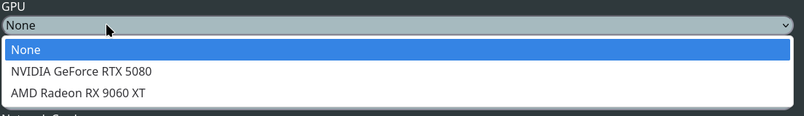

# Sprint 3 - Developing a Minimum Viable Product (MVP)

## Sprint Goals

Continue to develop the web application to the point that it provides all key functionality of the system. Test and refine it so that it can serve as the basis for the final phase of development.

### Specific Goals

**Edit these goals as needed**

- Create the following web pages:
    - Form for creating configurations which have compatable parts and accurate pricing.
    - Fully functional components page
    - Fully functional configurations page
    - All links working
- Develop SQL database queries to:
    - Same as sprint-2 (already done)
- Adding some colour as shown by ui prototyping to improve UX.
- Make overall theming close to that of the mock ups
- Preset configurations at least partially implemented
- Make default mandatory boot drive rather than being part of solid drives
- General tidy up of some messy leftover parts.
- Tidy up codebase

## Testing price calculating

This is the initial price calculation which as shown in the video does not work with multiple of the same component

### Changes / Improvements

Replace this text with notes any improvements you made as a result of the testing.

**PLACE SCREENSHOTS AND/OR ANIMATED GIFS OF THE IMPROVED SYSTEM HERE**

## Testing mandatory boot drive

I have now added a mandatory boot drive when making the NAS, this works and is incorperated into the price

## Testing selection options for GPU & other optional items

This is the initial testing for this style of item

### Changes / Improvements

After talking with my stakeholder we decided that for optional items instead of displaying -- Choose Me -- it should display None as it is more clear that this is an optional component

# Important pivot point

After discussing with my stakeholder and by attempting at methods of validiation, this current from style is not maintanable, i will be moving to a sessions based style for my component picking, which is step by step. I will be building my project with this is mind to still meet all of my other requirements of my stakeholder to make sure that the final product remains satisfactory.

## Testing FEATURE NAME HERE

Replace this text with notes about what you are testing, how you tested it, and the outcome of the testing

**PLACE SCREENSHOTS AND/OR ANIMATED GIFS OF THE TESTING HERE**

### Changes / Improvements

Replace this text with notes any improvements you made as a result of the testing.

**PLACE SCREENSHOTS AND/OR ANIMATED GIFS OF THE IMPROVED SYSTEM HERE**

## Testing FEATURE NAME HERE

Replace this text with notes about what you are testing, how you tested it, and the outcome of the testing

**PLACE SCREENSHOTS AND/OR ANIMATED GIFS OF THE TESTING HERE**

### Changes / Improvements

Replace this text with notes any improvements you made as a result of the testing.

**PLACE SCREENSHOTS AND/OR ANIMATED GIFS OF THE IMPROVED SYSTEM HERE**

## ETC...

## Sprint Review

Replace this text with a statement about how the sprint has moved the project forward - key success point, any things that didn't go so well, etc.

